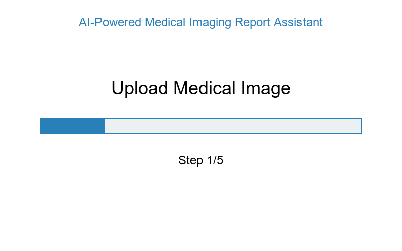

# AI-Powered Medical Imaging Report Assistant


<p align="center">
  
</p>

> An AI-powered assistant that helps radiologists analyze medical images and generate preliminary reports.

## 🌟 Features

- **🔍 Automated Anomaly Detection**: Identify and highlight potential anomalies in medical images
- **📝 AI-Generated Reports**: Create structured preliminary radiology reports
- **🔎 Similar Case Retrieval**: Find similar cases to aid diagnosis
- **👨‍⚕️ Radiologist-Friendly Interface**: Intuitive UI designed for medical professionals

## 📋 Table of Contents

- [Overview](#overview)
- [Demo](#demo)
- [Installation](#installation)
- [Usage](#usage)
- [Architecture](#architecture)
- [Technologies](#technologies)
- [Project Structure](#project-structure)
- [Contributing](#contributing)
- [License](#license)
- [Acknowledgements](#acknowledgements)

## 🔭 Overview

The AI-Powered Medical Imaging Report Assistant combines computer vision and natural language processing to assist radiologists in analyzing medical images and generating preliminary reports. The system detects potential anomalies in images, highlights them visually, and generates structured reports that can be reviewed and edited by medical professionals.

## 🎬 Demo

<p align="center">
  
</p>

## 🚀 Installation

### Prerequisites

- Python 3.8 or higher
- pip package manager

### Setup

1. Clone the repository:
   ```bash
   git clone https://github.com/Asfandyar1213/medical-imaging-report-assistant.git
   cd medical-imaging-report-assistant
   ```

2. Install dependencies:
   ```bash
   pip install -r requirements.txt
   ```

3. Run the application:
   ```bash
   python run.py
   ```

4. Access the web interface at [http://localhost:8501](http://localhost:8501)

## 💻 Usage

1. **Upload Medical Images**: Support for DICOM, JPG, and PNG formats
2. **View Analysis**: AI automatically detects and highlights potential anomalies
3. **Review Generated Report**: Edit AI-generated reports before finalizing
4. **Explore Similar Cases**: View similar cases to aid in diagnosis
5. **Export Reports**: Save or export the final report

## 🏗️ Architecture

<p align="center">
  
</p>

The system consists of three main components:

1. **Image Processing Module**: Analyzes medical images to detect anomalies
2. **Report Generation Module**: Creates structured reports based on findings
3. **Retrieval System**: Finds similar cases from a knowledge base

## 🔧 Technologies

- **Computer Vision**: MONAI, PyTorch
- **Natural Language Processing**: Hugging Face Transformers
- **Vector Database**: ChromaDB
- **Web Interface**: Streamlit
- **Medical Image Processing**: PyDICOM, OpenCV

## 📁 Project Structure

```
.
├── app.py                  # Main Streamlit application
├── config.py               # Configuration settings
├── requirements.txt        # Project dependencies
├── run.py                  # Application runner script
├── docs/                   # Documentation and images
├── models/
│   ├── image_processor.py  # Image analysis module
│   ├── report_generator.py # Report generation module
│   └── retrieval.py        # Similar case retrieval module
├── utils/
│   ├── dicom_utils.py      # DICOM file handling utilities
│   └── visualization.py    # Image visualization utilities
└── data/
    ├── sample_images/      # Sample medical images
    └── knowledge_base/     # Vector database storage
```

## 👥 Contributing

Contributions are welcome! Please feel free to submit a Pull Request.

1. Fork the repository
2. Create your feature branch (`git checkout -b feature/amazing-feature`)
3. Commit your changes (`git commit -m 'Add some amazing feature'`)
4. Push to the branch (`git push origin feature/amazing-feature`)
5. Open a Pull Request

## 📄 License

This project is licensed under the MIT License - see the [LICENSE](LICENSE) file for details.

## 🙏 Acknowledgements

- [MONAI](https://monai.io/) for medical imaging tools
- [Hugging Face](https://huggingface.co/) for NLP models
- [Streamlit](https://streamlit.io/) for the web interface
- Open medical imaging datasets used for testing

---

<p align="center">
  Made with ❤️ for advancing healthcare technology
</p> 